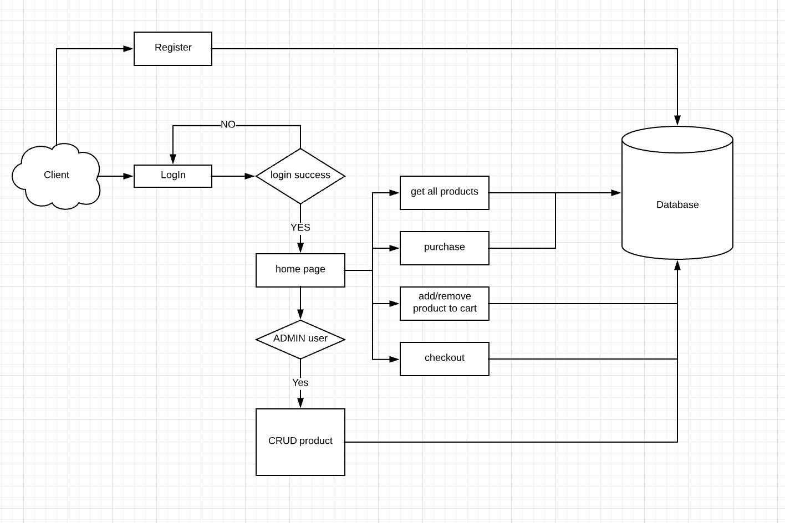
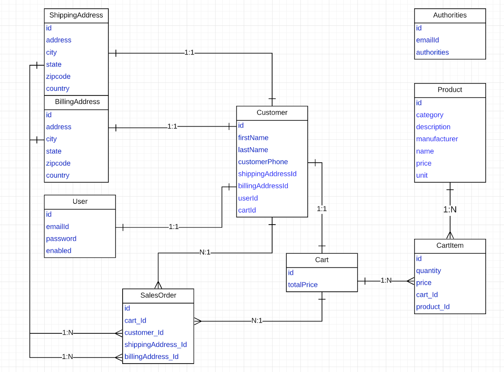

# Spring and Hibernate based Shopping and Ordering System

1. Used Spring framework to build a web application for users to shop and order items online
2. Built a web application based on Spring MVC to support item search and listing (dependency injection, inversion of control, REST API, etc.)
3. Implemented security workflow via in-memory and JDBC authentication provided by Spring Security 
4. Utilized Hibernate to provide better support of database operations
5. Developed a Spring Web Flow to support item ordering

## Structure of this project


## How to Run 

1. Start tomcat server
2. Tomcat read web.xml to start Spring by ContextLoaderListener
3. Spring scan annotaion and create relative bean 
4. In applicationConfig.java will initlize and start Hibernate
5. Online-shop start up suceesfull and ready to receive the request from user

## Online Shop Application using Spring Web MVC

```
Step 1: Create a Maven Project
Step 2: Update Pom.xml
Step 3: Update web.xml
Step 4: Create onlineShop-servlet.xml
Step 5: Create POJO Classes 
Step 6: Create DAO Classes : Create an interface/classes for accessing the MySQL Database
Step 7: Create Service
Step 8: Create Controllers
Step 9: Create ApplicationConfig
Step 10: Create check-out using Spring work flow
Step 11: Using Spring Security for Authentication and Authorization
Step 12: Create Views
Step 13: Run the Application 

```

## Hibernate 

The Spring framework provides HibernateTemplate class, so follow steps like create Configuration, BuildSessionFactory, Session, beginning and 
committing transaction to connect mySql database.
 
ER diagram used in Hibernate 



